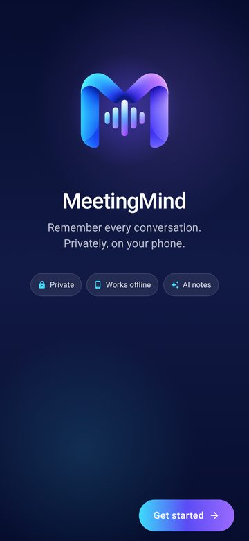
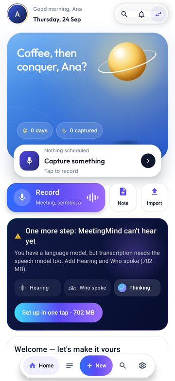
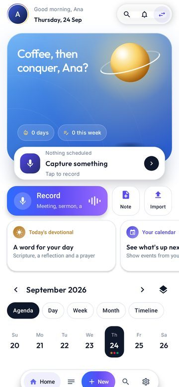
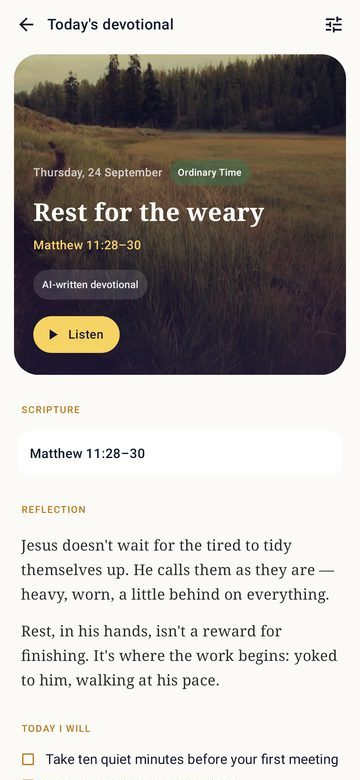
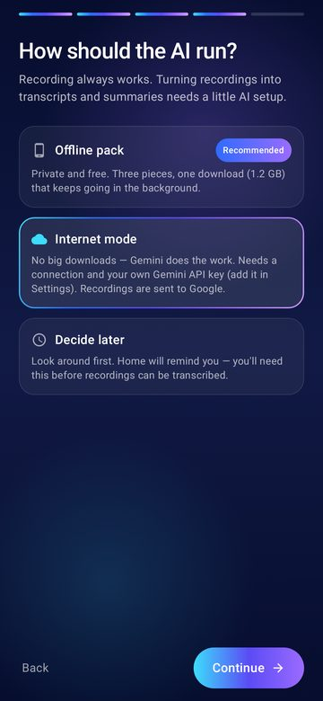
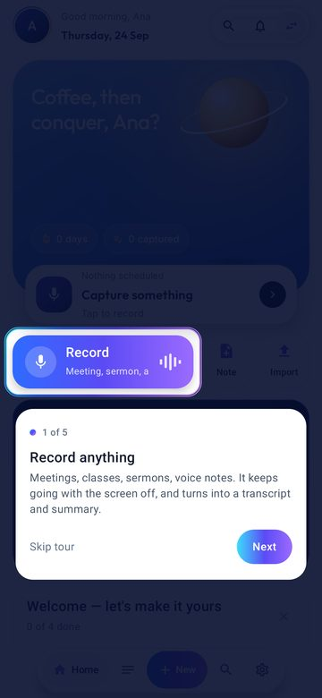
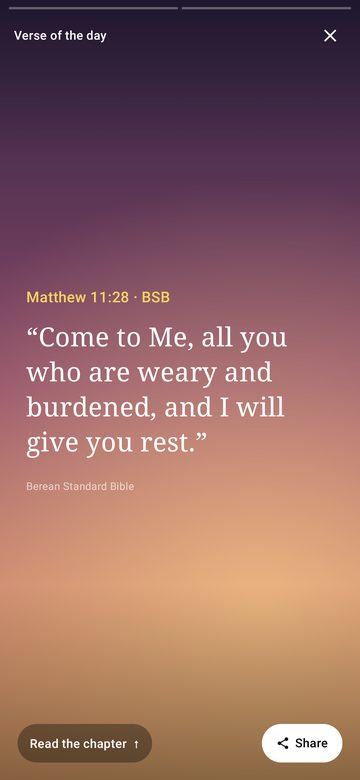
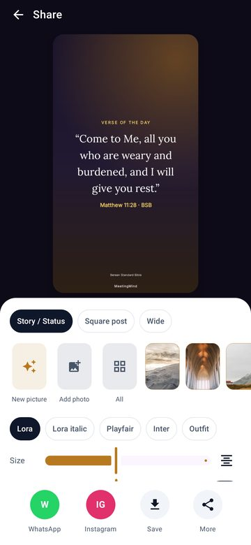

<div align="center">


# MeetingMind

**Remember every conversation. Privately, on your phone.**

MeetingMind is an Android app that records meetings, lectures, sermons and voice notes, then
transcribes them, works out who said what and turns them into notes, summaries and action items,
entirely on the device. A calendar-style Today hub ties it together, and there's an optional
Faith space with a Bible, daily devotionals and prayer tools.

[Download the latest APK](dist/) · [What's new](dist/README.md) · [Product plan](docs/PLAN_V2.md)

</div>

<p align="center">
  
  
  
  
</p>

---

## What it does

### Capture and understand
- **Record anything.** Recording keeps going with the screen off, and a journal recovers it if
  the app is killed. You can also import audio and video.
- **Transcripts on the phone:**
  - Parakeet speech-to-text, with voice activity detection.
  - Speaker diarization, so you can see who said what.
  - Filler-word cleanup, word-level editing and playback that follows along.
- **Meeting intelligence:**
  - Summaries, decisions and action items.
  - 19 transcript AI tools.
  - Ask questions about any recording, with answers cited back to the transcript.
- **Recording types:** meeting, lecture, interview, sermon, voice memo and more. Each type
  guides what the AI pulls out.

### Notes
- Notes are the core object, and a recording is a source attached to one.
- Block editor with headings, checklists, photos, video, scripture and inline transcripts.
- Notebooks, tags, templates, search, and related notes.
- Note AI: summarise, organise, extract actions and ask.
- Export to PDF, DOCX and Markdown. Transcripts can also be exported as subtitles or CSV.

### The Today hub (Home)
- **Hero header:** a live time-of-day sky, greetings and an "Up next" tile.
- **Record button:** a prominent Record button, with Note and Import beside it.
- **Timeline** from every source: calendar events, recordings, notes, tasks and faith items.
  - Five views: Agenda, Day, Week, Month and a scrolling Timeline.
- **Nudges:** meeting prep cards, learned rhythms ("you usually record on Sundays at 10:30"),
  and memories from this day in past years.
- **Stories:** your day as full-screen stories you can share.

### Faith (optional, and hidden for professional use)
- **Bible:**
  - More than 1,200 open translations to read online or download for offline reading and
    search.
  - An audio Bible that follows along verse by verse.
  - Cross-references, classic commentaries, highlights, and reading plans.
- **Daily devotionals:**
  - Written by AI and clearly labelled, a bundled classic (Spurgeon), or your own.
  - Read aloud in a "preacher" voice.
  - Shareable as image cards to WhatsApp Status or Instagram Stories.
- **Pray with me and Talk it through:** live spoken prayer and reflection with Gemini Live.
- **Praying for:** a rotating prayer list, reminders, widgets, and sermon notes end to end.

### Built for first-time users
- **Onboarding:** a guided welcome that sets up your name, what you use the app for, how the AI
  runs, and permissions.
- **Setup guide:** explains the offline AI as three jobs (Hearing, Who spoke, Thinking) and gets
  them in one tap. Home and Record remind you until setup is done.
- **Getting started checklist and a quick tour of Home.**

<p align="center">
  
  
  
  
</p>

---

## Privacy: offline first

| Mode | What happens to your audio |
| --- | --- |
| **Offline** (default) | Everything runs on the phone. Nothing leaves it. |
| **Internet** (opt in) | Gemini transcribes and summarises. Recordings go to Google. Needs your own API key, which you enter in the app and which is never built into the APK. |

A setting that can't be read always falls back to Offline, so the app never starts uploading by
accident. See [docs/DATA_SAFETY.md](docs/DATA_SAFETY.md).

### On-device models

The app downloads these from inside the app, in the background, with resume:

| Job | Model | Size |
| --- | --- | --- |
| Hearing | Silero VAD + Parakeet TDT 0.6B v3 (INT8), via sherpa-onnx | ~670 MB |
| Who spoke | pyannote segmentation + CAM++ speaker embeddings | ~31 MB |
| Thinking | Qwen2.5 1.5B Instruct, or 0.5B on smaller phones, or Phi-4 mini for the best quality, via MediaPipe | 0.5–3.9 GB |

---

## Install

1. Download the newest `MeetingMind-vNN-arm64-v8a.apk` from [`dist/`](dist/). It's for 64-bit
   ARM phones, which is almost all current ones.
2. Allow installs from your browser or file manager, then open the APK.
3. Follow the welcome. Choose **Offline pack** to download the AI (about 1.2–2.3 GB, best on
   Wi-Fi), or **Internet mode** and add a Gemini key in Settings.

These builds are debug-signed and meant for testing.

## Build from source

**You need:** Android Studio (or the command-line SDK) and JDK 17+. The Android SDK targets
API 36; the minimum is API 24.

```bash
git clone https://github.com/creativesites/MeetingMind.git
cd MeetingMind
./gradlew assembleDebug          # APKs in app/build/outputs/apk/debug/
./gradlew testDebugUnitTest      # JVM + Robolectric tests, Roborazzi screenshots
```

Optional keys go in `local.properties`, which is gitignored. Never commit them.

```properties
sdk.dir=/path/to/Android/sdk
# YouVersion Platform key, for licensed Bible translations (open ones work without it)
youversion.appKey=...
```

Gemini keys are never part of the build. Each person enters their own in
**Settings → Internet mode**.

## Tech stack

- **Language and UI:** Kotlin 2.2 and Jetpack Compose (Material 3).
- **Storage:** Room (schema v14) and DataStore.
- **Background work:** WorkManager for processing, downloads, devotionals and reminders.
- **Media:** Media3 for playback.
- **On-device AI:** sherpa-onnx (VAD, ASR, diarization) and MediaPipe GenAI (LLMs).
- **Cloud AI:** OkHttp to the Gemini API: text generation, TTS, images, and Live over WebSocket.
- **Tests:** Robolectric and Roborazzi for screenshot tests, with 870+ unit and UI tests.

```
app/src/main/java/com/example/
├── ai/        speech, diarization, LLM routing, Gemini (cloud, live, voice), pipeline, tools
├── core/      data (Room, DataStore), notes, timeline, scripture, devotional, setup, share, ui
└── feature/   screens: today, recording, notes, meetingdetail, faith, bible, devotional,
               stories, share, prayer, onboarding, setup, settings, search, models
```

## Documentation

| Doc | What's in it |
| --- | --- |
| [PLAN_V2.md](docs/PLAN_V2.md) | The current plan (Today hub, Faith, devotionals, voice, stories) and its status |
| [PLAN_V1.md](docs/PLAN_V1.md) | Notes, workflows, scripture, sermons, Internet mode |
| [PRODUCT_DIRECTION.md](docs/PRODUCT_DIRECTION.md) | Product decisions and reasoning |
| [ARCHITECTURE.md](docs/ARCHITECTURE.md) / [AI_ARCHITECTURE.md](docs/AI_ARCHITECTURE.md) | How the app and its AI pipeline fit together |
| [TRANSCRIPTION_OVERHAUL.md](docs/TRANSCRIPTION_OVERHAUL.md) | The transcription pipeline in depth |
| [DATA_SAFETY.md](docs/DATA_SAFETY.md) | What data goes where |
| [dist/README.md](dist/README.md) | Release notes for every build |
| [THIRD_PARTY_NOTICES.md](THIRD_PARTY_NOTICES.md) | Licences for models, fonts, Bible texts, images and quotes |

## Status

MeetingMind is in active development and being tested with a small group of friends. The
professional core and the Faith space are complete. More verticals, such as Learning, come next.
